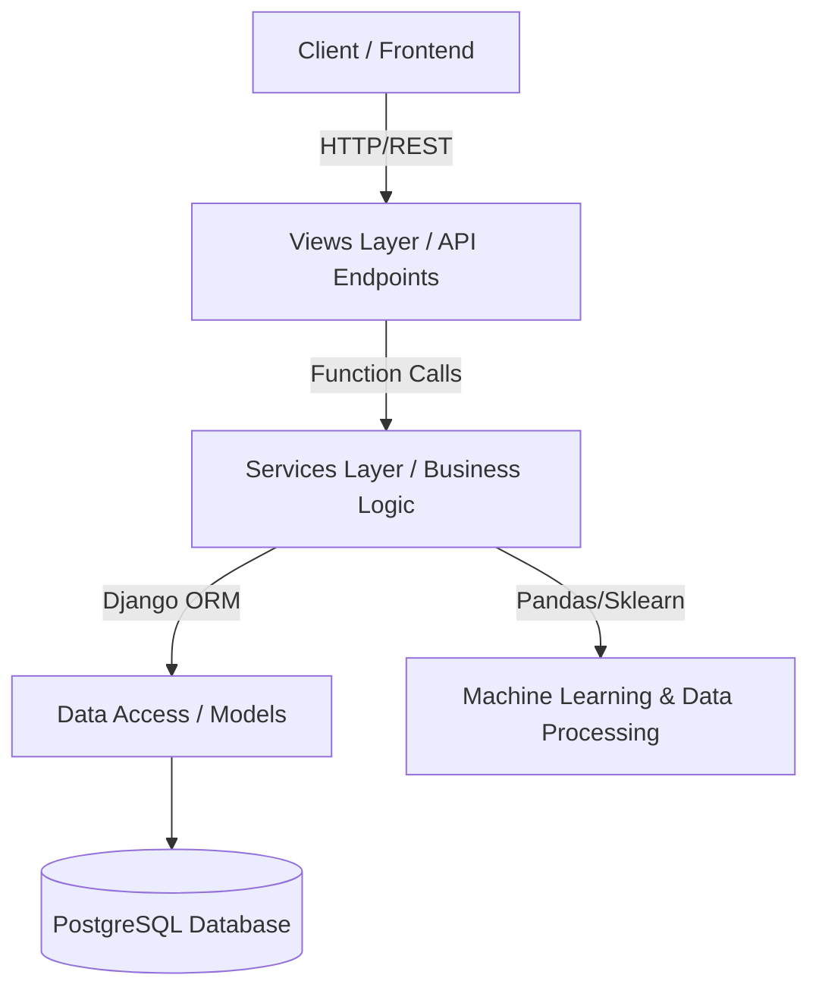
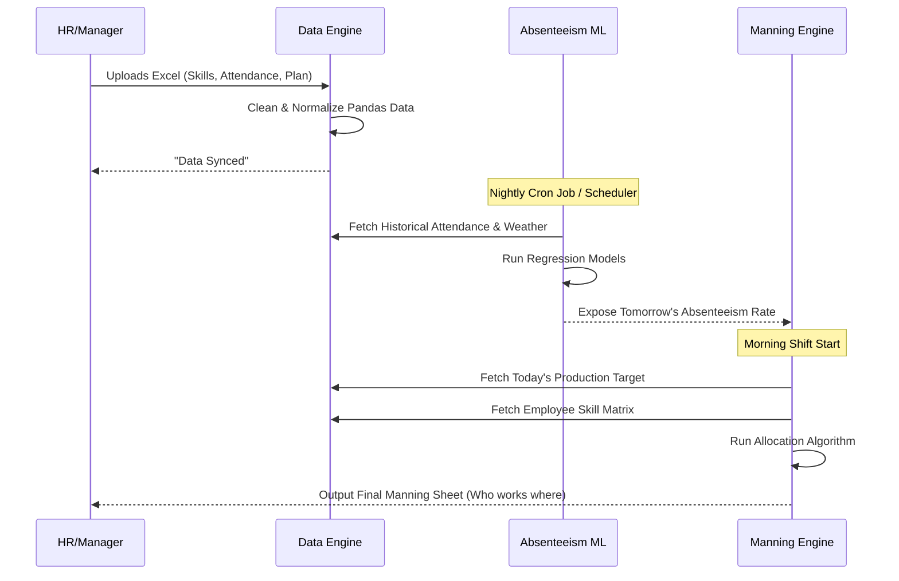

# System Design & Architecture: Laguna-AI Line Balancing

This document serves as a high-level technical breakdown of the Laguna-AI Line Balancing application. It explores the core architectural patterns, the data flow, and the business logic behind the four primary domains.

---

## 1. High-Level Architecture Pattern

The backend follows a **Domain-Driven Design (DDD)** approach built on top of Django. Instead of putting all the logic into massive "Fat Views" or "Fat Models", the application strictly separates concerns into **Service Layers**.

### Why this architecture?
1. **Scalability:** When data processing (Pandas) gets heavy, it doesn't crash the web request.
2. **Reusability:** A service in `data_engine` can be easily imported and used by `manning_sheet` without circular dependencies.
3. **Clean Routing:** `views.py` files are incredibly thin—they only parse incoming requests and return JSON responses, delegating all the actual work to `services/`.

---

## 2. The Four Core Domains (Apps)

The system is split into four highly specialized micro-apps.

### A. Accounts (`apps/accounts`)
Handles everything related to identity and security.
- **Authentication:** Custom token-based auth (`MultiSessionTokenAuthentication`).
- **Geofencing:** Ensures users (like factory workers or managers) can only clock in or access data if their GPS coordinates fall within the factory's geofenced radius.

### B. Data Engine (`apps/data_engine`)
The core ETL (Extract, Transform, Load) pipeline. Factories produce massive amounts of raw CSV/Excel data. This app cleans it.
- **Inputs:** Employee Master, Operation Master, Skill Matrix, Historical Weather, Holiday Calendars.
- **Process:** It reads uploaded files into Pandas DataFrames, sanitizes null values, normalizes dates, and bulk-inserts them into PostgreSQL.

### C. Absenteeism Prediction (`apps/absenteeism`)
The Machine Learning brain. It predicts how many people are going to be absent tomorrow so the factory can plan ahead.
- **Data Gathering:** Merges historical attendance data with local weather forecasts (e.g., if it rains heavily, absenteeism spikes).
- **Modeling:** Uses statistical/machine learning models (via Scikit-Learn/Pandas) to forecast absenteeism percentages per department or factory line.

### D. Manning Sheet Engine (`apps/manning_sheet`)
The crown jewel of the application. It balances the factory lines.
- **The Problem:** You have 100 machines, 120 employees, but 10 are predicted to be absent. Who goes to which machine to maximize efficiency?
- **The Engine:** 
  1. Fetches available employees from `data_engine`.
  2. Subtracts the predicted absentees from `absenteeism`.
  3. Looks at the `skill_matrix` to see who knows how to operate which machine.
  4. Runs an **Allocation Algorithm** to assign the optimal worker to the optimal machine.

---

## 3. Data Flow & Execution Pipeline

Here is how data physically flows through the system on a day-to-day basis:

---

## 4. Background Schedulers

Because running Machine Learning predictions and generating allocation sheets for thousands of employees takes time, the application uses **Management Command Schedulers**.

Instead of making a user wait for an API request to finish, scheduled tasks run in the background (often overnight or early morning):
- `python manage.py absenteeism_scheduler`: Runs the ML models while the factory sleeps.
- `python manage.py manning_sheet_scheduler`: Pre-calculates the optimal line balance before the shift begins.

## 5. Summary

At its core, **Laguna-AI Line Balancing** is an intelligent ERP tool. It replaces manual factory floor management by combining robust data engineering (Pandas), predictive AI (Scikit-Learn), and algorithmic resource allocation to ensure factory lines run at maximum efficiency regardless of unpredictable daily absences.
