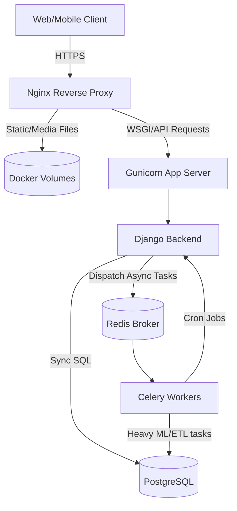
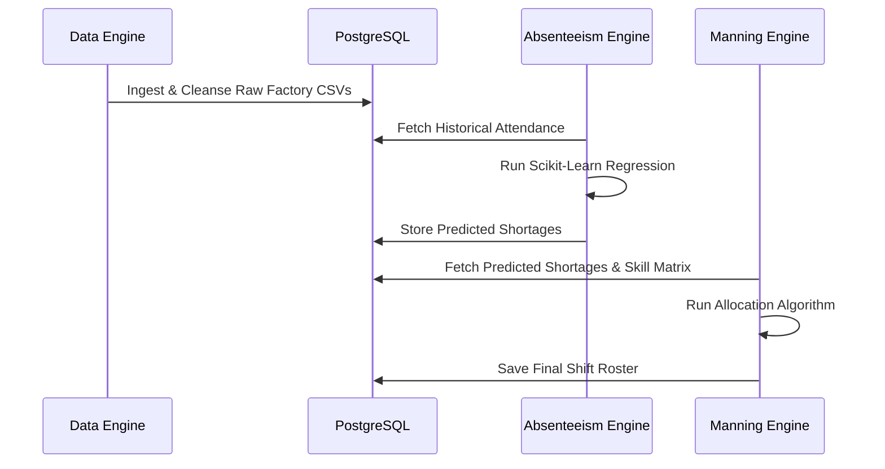
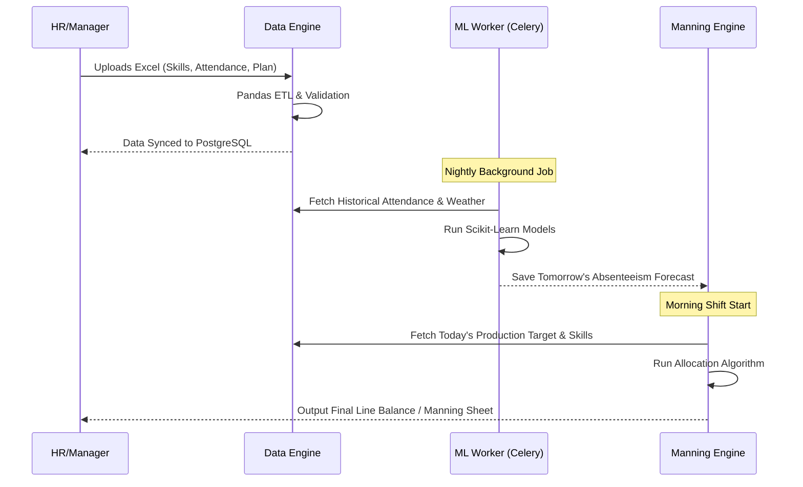

# System Design & Architecture: Laguna-AI Line Balancing

This document serves as the comprehensive technical system design for the Laguna-AI Line Balancing application. It outlines the infrastructure, software patterns, data flow, and security models used to build the platform from scratch.

---

## 1. System Overview & Tech Stack

Laguna-AI Line Balancing is an intelligent, automated ERP platform designed to optimize factory floor operations by predicting employee absenteeism and algorithmically balancing production lines.

**Core Technology Stack:**
- **Backend Framework:** Django (Python) / Django REST Framework
- **Data Engineering & ML:** Pandas, NumPy, Scikit-Learn
- **Database:** PostgreSQL
- **Task Queue & Caching:** Celery & Redis
- **Web Server:** Nginx & Gunicorn
- **Containerization:** Docker & Docker Compose
- **API Documentation:** Swagger (drf-yasg)

---

## 2. Infrastructure Architecture

The application is fully containerized using Docker, allowing a seamless transition between development and production environments using a layered approach (`docker-compose.yml`, `docker-compose.override.yml`, and `docker-compose.prod.yml`), easily managed via the provided `start` scripts.

### Key Infrastructure Components:
1. **Nginx:** Acts as the entry point. It serves static assets (CSS, JS) and media files directly from volumes, routing dynamic API requests to Gunicorn.
2. **Gunicorn:** A production-grade WSGI HTTP server that runs the Django application with multiple worker processes.
3. **Celery & Redis:** Heavy Machine Learning computations and daily cron schedulers are offloaded to Celery workers using Redis as the message broker, ensuring the main API never blocks or times out.

---

## 3. Application Architecture (Domain-Driven Design)

The backend code eschews traditional "Fat Views" and "Fat Models" in favor of strict **Service Layer** and **Domain-Driven Design (DDD)** principles.

### The Request Lifecycle
1. **Routing (`urls.py`)**: Maps the HTTP endpoint.
2. **Views (`views.py`)**: Extremely thin endpoints. They handle HTTP parsing, validate parameters, and immediately delegate to the Service Layer.
3. **Services (`services/`)**: The brain of the application. Contains all business logic, Pandas ETL transformations, and ML model invocations.
4. **Utils Facade (`utils/`)**: Reusable generic helpers (CSV generation, Email sending via SendGrid, Math helpers) are broken into modular files (e.g., `email_utils.py`, `csv_utils.py`) but exposed through a `__init__.py` Facade to prevent import breakages across services.
5. **Models (`models.py`)**: Strictly for Django ORM data definitions and database constraints.

---

## 4. The Four Core Domains (Apps)

The system is compartmentalized into four specialized micro-apps in `backend/apps/`. Below is the automated Data Pipeline flow between these core engines:

### A. Accounts (`apps/accounts`)
Handles Identity and Access Management (IAM).
- **Authentication:** Custom token-based auth using SimpleJWT, integrated with **Google SSO (OAuth 2.0)** via `django-allauth` and `dj-rest-auth` for seamless enterprise login.
- **Geofencing:** Validates GPS coordinates to ensure factory workers are physically on-site before clocking in.

### B. Data Engine (`apps/data_engine`)
The core ETL pipeline engine.
- **Ingestion:** Reads raw CSV/Excel files (Skill Matrices, Employee Masters, Holiday Calendars).
- **Processing:** Uses Pandas to sanitize nulls, normalize dates, and bulk-insert millions of rows into PostgreSQL efficiently.

### C. Absenteeism Prediction (`apps/absenteeism`)
The Machine Learning inference engine.
- **Inputs:** Historical attendance, shift data, and weather APIs.
- **Execution:** Runs regression models via Scikit-Learn to forecast the exact absenteeism percentage per factory line for the upcoming days.

### D. Manning Sheet Engine (`apps/manning_sheet`)
The resource allocation algorithm.
- **Execution:** Subtracts the predicted absentees from the available pool, cross-references the employee skill matrix, and assigns the optimal worker to the optimal machine to hit the daily production target.

---

## 5. Security & Data Integrity Model

Built for production, the application implements strict security and database integrity protocols:

1. **CSRF Protection over Proxies:** 
   - Django 4.0+ strict CSRF validation is enabled. `CSRF_TRUSTED_ORIGINS` is dynamically mapped alongside `ALLOWED_HOSTS` to ensure the Django Admin panel functions securely behind Docker/Nginx proxies without throwing `403 Forbidden` errors.
2. **Relational Database Integrity:**
   - JWT tokens are tracked in `OutstandingToken` and `BlacklistedToken` tables. 
   - We utilize Django `pre_delete` signals on the `User` model to automatically cascade-delete blacklisted tokens. This prevents fatal `ProgrammingError` / Foreign Key Constraint crashes when an administrator deletes a user from the system.
3. **Centralized Assets:**
   - Email templates are housed globally in `backend/templates/` to prevent app-level collision and enforce a single source of truth for corporate branding.

---

## 6. Daily Execution Pipeline

The day-to-day data flow relies heavily on background automation.

